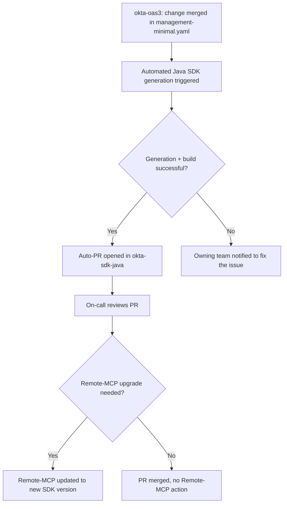

# okta-oas3 → okta-sdk-java → remote-mcp Sync Process

Scope note: our work was fixing SDK generation (`scripts/`, see
[GENERATION_FIXES.md](scripts/GENERATION_FIXES.md)) so a spec refresh produces
a compiling SDK. This document only records the intended end-to-end process;
implementation of the automation itself is owned by the Developer Products
team.

## Steps

1. **Spec change merged** — a PR merges into `okta-oas3`, changing
   `specs/monolith/dist/codegen/management-minimal.yaml`.
2. **Generation triggered** — automation runs the SDK generation pipeline
   (fix-spec → codegen → fix-generated → build) against the updated spec.
3. **Success** → opens a PR in `okta-sdk-java` with the regenerated sources.
4. **On-call reviews the PR** — decides if the change warrants a Remote-MCP
   upgrade.
5. **Failure** → the owning team is notified to fix the issue (spec defect,
   generator/version mismatch, or a new fix needed in `scripts/`).

## Open questions (for Developer Products to resolve)

- What triggers step 2 (oas3 merge webhook, scheduled job, manual)?
- Who/what is "the owning team" in step 5 — spec author, SDK team, both?
- Does a failure in step 2 block the oas3 merge, or is it always post-merge/async?
